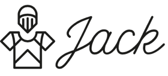
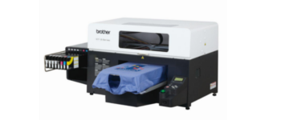
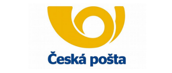
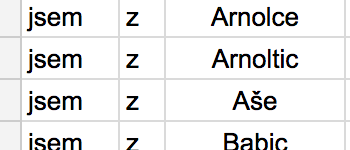
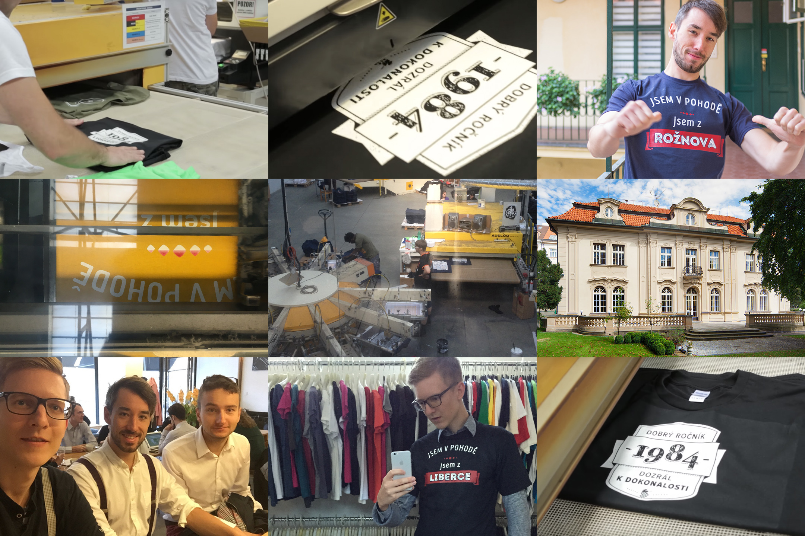

## Hledáme Pythonistu na vytisknutí ```(60 * 10 * 100)``` kusů 👕

* **Kde:** Praha (Kancelář v [bývalé Dánské ambasádě](http://k10.online/cs/))
* **Od kdy:** Červenec 2016
* **Co:** Full-time / Part-time
* **Na čem:** Vývoj Jack pro [CZ](http://jack.cz), [SK](http://jack.sk), DE, PL 
* **Plat:** 50 000 - 90 000 CZK / měsíčně (možnost podílu)
* **Buzzwords:** Python, Flask, AngularJS, HTML5, GAE, NDB, Jinja

## Proč Jack.cz
Jack je on demand printing projekt napojený na desítky tiskařských strojů Brother GT-3 a několik dopravců. Použitá technologie umožňuje prodávat miliony položek v eshopu (trička, mikiny, hrnky...) s minimálními skladovými náklady. Máme za sebou [úspěšný rok v ČR](https://www.facebook.com/wwwjackcz) a jdeme do světa. Plánovaný obrat na letošní rok je 30 miliónů korun.

## Čím jsme jiní

* **Děláme fyzické produkty** – data, která pošleš do tiskárny, uvidíš lidi nosit na ulici
* **Máme pod kontrolou celý value chain** – produkty navrhujeme, marketujeme, tiskneme přes partnera a staráme se o logistiku
* **Spravujeme velký objem reklam** – pro naše potřeby neexistují konvenční nástroje – vyvíjíme vlastní
* **Chceme se toho hodně naučit** – aktivně spolupracujeme s několika mentory. Jedním z nich je třeba [Jakub Roztočil](http://roztocil.co/), Entrepreneurialní full-stacker s mnohaletými zkušenostmi ze startupů v Kodani a San Franciscu, autor mj. [nejpopulárnějšího Python projektu na GitHubu](https://github.com/jkbrzt/httpie).

## O čem to bude
*  Optimalizace generování tiskových dat
*  Rozvoj back-endu napojeného na tiskařské stroje
*  Kombinování dat a automatizace správy velkého počtu reklam
* Jsme hračičkové a stojíme za těmito projekty:
  * [Techsquat](http://www.lupa.cz/clanky/reportaz-brnensky-techsquat-je-klaster-pro-podnikave-geeky/)
  * [Bitbrno](http://www.tyinternety.cz/ostatni/salinou-za-bitcoiny-brno-jako-prvni-mesto-vyzkouselo-jestli-to-jde/)
  * [Měření plynu v Paralelní Polis](http://gas.paralelnipolis.cz/)
  * [Bileto](http://www.tyinternety.cz/startupy/startuje-bileto-dalsi-projekt-s-jakubem-havrlantem-v-pozadi/)
  * [Zeď na Andělu](http://praha.idnes.cz/v-metru-andel-lide-pisi-basnicky-a-vzkazy-fpg-/praha-zpravy.aspx?c=A141219_2125663_praha-zpravy_bur)
* Budeš pracovat s námi
  * [Pavel Král](http://github.com/pavelkraleu)
  * [Vladimír Mokrý](http://vmokry.com)
  * [Jan Antonín Kolář](https://linkedin.com/in/janantoninkolar)

## Jak to děláme

### Tiskneme na tiskárnách Brother GT-3
 Tato tiskárna umí tisknout při 1200 DPI, tiskové soubory tak můžou mít až 16800x19200px a to je dost dat - stovky mega. Trochu jiný [kafe než na Instáči](https://www.google.cz/search?q=coffee+instagram&biw=960&bih=962&source=lnms&tbm=isch&sa=X&ved=0ahUKEwiJ-KbqwfLMAhWGfxoKHV8tCCYQ_AUIBigB).


A aby toho nebylo málo, tak na vygenerování těchto dat bys neměl spotřebovat veškerou RAMku ve střední Evropě a při jejich nahrávání do tiskárny neutavit USB kabel. *Good luck with that.*

### Google App Engine
 Na světě jsou zábavnější věci než řešit došlé místo na disku nebo latence na síti. Nejenom z těchto důvodů Jack běží na App Enginu od Googlu. Jako databázi používáme NDB, která umí *sexy* věci jako je [async operations](https://cloud.google.com/appengine/docs/python/ndb/async).


Můžeš se taky podívat na [Google prediction API](https://cloud.google.com/prediction/) a pomoci nám lépe doporučovat zboží návštěvníkům.

### Distribuce
 Musíme mít přesný přehled, kde jsou naše zásilky, z toho důvodu scrapujeme web České pošty (*Ne, API nemají*) a jiných dopravců a zjišťujeme, kde trička cestují. 

Tuto knihovnu by jsme rádi uveřejnili jako open-source, chceš se toho ujmout ?

### Máme tričko pro každou obec
 V Čechách je kolem 6000 obcí a my máme tričko pro každou z nich. Tomu předcházela *science*, kdy jsme museli stáhnout názvy všech obcí, naskloňovat je, určit správnou velikost fontu, zjistit kde se nachází, vytvořit reklamu... I pro tu nejmenší obec v republice.

To si potom sedíš ráno v [Emě](http://www.emaespressobar.cz/), popíjíš kávu a vidíš před oknem projít člověka v tričku, který vygeneroval, vytisknul a odeslal tvůj Pythoní kód.

## Jack není obyčejný e-shop

Většina e-shopů prodává, co jiný vyrobil. My si zboží vyrábíme sami a běžné marketingové nástroje v našem měřítku selhávají. Z tohoto důvodu není Jack obyčejný e-shop uplácaný v Prestashopu za víkend.


## Kontakt
Zaujalo? Napiš na jan@jack.cz případně na tel.: +420.775272827

## Pics or it didn't happen:


